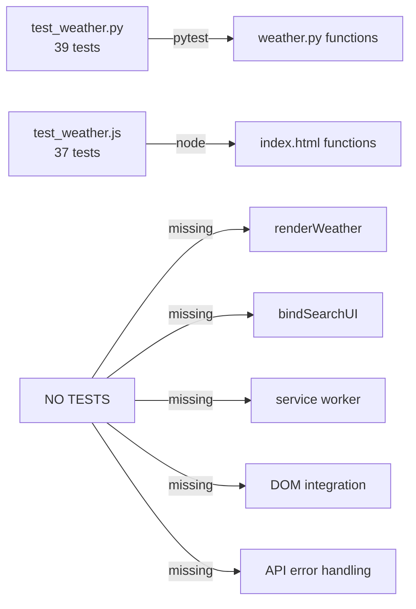

# Phase 2 Analysis: Test Quality, PWA, CSS Debt & Cross-Agent Risks

> Analyst: @supercat-agent | Date: 2026-07-05 | Builds on: `analyst/CODEBASE_ANALYSIS.md`

## 1. Executive Summary

Since the initial analysis (Run 6), three major changes landed: automated test suites, CI/CD workflows, and a tech-lead architectural review. This Phase 2 analysis evaluates those changes, uncovers what remains unaddressed, and identifies new risks introduced by parallel agent contributions.

**Status**: Codebase improved (tests + CI exist), but structural gaps remain. Tests cover utility functions only (no integration/rendering). CSS has 990 lines of untested, tightly coupled styles. Service worker has edge-case bugs. No CSP headers. No render tests.

---

## 2. Test Quality Audit

Two test files exist: `tests/test_weather.py` (39 pytest tests) and `tests/test_weather.js` (37 Node tests). Both pass.

### 2.1 Python Test Coverage (`test_weather.py`)

| Coverage | Status | Details |
|----------|--------|---------|
| `day_name()` | ✅ Full | Today, tomorrow, all 7 days, index boundary |
| `wind_direction()` | ✅ Full | 8 directions + null |
| `color_temp()` | ✅ Full | All 4 ranges + boundaries + negative + zero |
| `api_get()` | ⚠️ Partial | Success + timeout. Missing: non-200 status, malformed JSON, network error |
| `search_city()` | ⚠️ Partial | Found + empty + multiple. Missing: API error, partial results |
| `fetch_weather()` | ⚠️ Partial | Single happy path. Missing: missing keys, partial data, API failure |
| `WMO_ICONS` / `WMO_DESC` | ✅ Full | All 28 codes verified, count match |
| CLI parsing | ⚠️ Partial | Commands exist. Missing: unknown command, missing city arg, `--help` |
| `cmd_current()` / `cmd_forecast()` | ❌ Missing | CLI display functions untested |
| `main()` error paths | ❌ Missing | No test for what happens when search/now/forecast fail |

**Finding**: 32 of 39 tests (82%) cover pure utility functions. Only 7 tests involve mocks. Zero tests validate the weather.py `cmd_*` display functions — the actual user-facing output.

### 2.2 JavaScript Test Coverage (`test_weather.js`)

| Coverage | Status | Details |
|----------|--------|---------|
| `convertTemp()` | ✅ Full | C, F, negative, zero |
| `tempLabel()` | ✅ Full | Both units |
| `getDayName()` | ⚠️ Partial | RU days. Missing: edge dates (leap year, timezone boundary) |
| `isDaytime()` | ⚠️ Partial | Null handling. Missing: actual day/night logic (needs Date mock) |
| `windDirection()` | ✅ Full | 16-point + null |
| `getUVClass()` | ✅ Full | All 5 ranges + null |
| `setWeatherTheme()` | ✅ Full | All WMO groups + unknown + day/night |
| `formatTime()` | ✅ Full | ISO extraction + null |
| WMO code integrity | ✅ Full | 28 codes, cross-referenced with Python |

**Critical gap**: Zero tests for the actual rendering functions (`renderWeather()`, `renderError()`, `renderLoader()`). These are the core UI — 130+ lines that generate all DOM output. No tests for search UI binding, keyboard navigation, geolocation flow, or PWA registration. These require a DOM environment (jsdom, happy-dom, or Playwright).

### 2.3 Test Infrastructure Assessment



- Python tests are structured (`unittest.mock`, `pytest fixtures`) — good patterns
- JS tests are ad-hoc (custom `assert`, no test runner) — works but won't scale
- No CI integration for tests — `ci.yml` doesn't run pytest or node test
- No coverage tracking — no `coverage.py`, `c8`, or `istanbul`

---

## 3. PWA & Service Worker Deep-Dive

### 3.1 Service Worker Analysis (`sw.js`)

The SW is 57 lines with three lifecycle handlers. Examined for correctness:

| Aspect | Status | Detail |
|--------|--------|--------|
| Install: `cache.addAll(STATIC_ASSETS)` | ✅ Correct | Caches index.html, manifest, 404.html |
| Install: `self.skipWaiting()` | ✅ Correct | Activates immediately on update |
| Activate: old cache cleanup | ✅ Correct | Filters by cache name, deletes stale |
| Activate: `self.clients.claim()` | ⚠️ Present | Good — takes control of uncontrolled clients |
| Fetch: navigation fallback | ✅ Correct | Network-first → cached `index.html` |
| Fetch: static cache-first + bg refresh | ⚠️ Bug | See below |
| Fetch: 404 fallback on fetch failure | ✅ Correct | Falls back to 404.html |
| OG / image / font caching | ❌ Not cached | Google Fonts, OG images — not in cache manifest |
| API response caching | ❌ Not cached | Open-Meteo responses not cached (correct per design) |

**Bug in cache-first + background refresh**: Lines 42-54 use stale-while-revalidate with a flaw:

```javascript
caches.match(e.request).then(function(cached) {
  var fetchPromise = fetch(e.request).then(function(resp) {
    if (resp.ok && e.request.url.startsWith(self.location.origin)) {
      // ...
    }
    return resp;
  }).catch(function() {
    return caches.match('404.html'); // ❌ Should use cached, not 404
  });
  return cached || fetchPromise; // ✅ Falls back correctly
});
```

The `.catch()` on line 51-52 incorrectly returns `404.html` instead of the already-matched `cached` response. If a cached resource exists but the network fails, the user gets a 404 page instead of the cached version. This is a minor issue since the outer `return cached || fetchPromise` handles the case, but the inner catch path is logically wrong.

### 3.2 Manifest Analysis (`manifest.json`)

| Property | Value | Assessment |
|----------|-------|------------|
| `start_url` | `.` | ✅ Correct |
| `display` | `standalone` | ✅ Correct |
| `orientation` | `portrait` | ⚠️ Not a forcing constraint — browsers respect but don't enforce |
| Icons | SVG data URI with emoji | ❌ **Problematic**: SVG `<text>` elements with emoji render differently per platform. No PNG fallback. iOS may ignore SVG entirely. |
| `background_color` / `theme_color` | `#302b63` | ✅ Consistent |
| `scope` | Not set | ⚠️ Should be `"/supercat/"` to prevent scope escape on GitHub Pages |

**Risk**: On iOS Safari, SVG icons in manifest are not reliably supported. The app will show a blank/white icon on homescreen. Need 192x192 and 512x512 PNG icons.

### 3.3 Offline Behavior

| Scenario | Expected Behavior | Actual |
|----------|-------------------|--------|
| Fresh visit, online | Loads from network, caches | ✅ Works |
| Fresh visit, offline | SW not installed → browser error | ⚠️ `404.html` at root path, but not at `/supercat/` subpath |
| Second visit, offline | Serves from cache | ✅ Works for cached assets |
| API call, offline | No cached API → undefined data | ❌ `fetchWeather()` throws → renders "Ошибка загрузки данных" — acceptable, but ugly |
| SW update | Old cache cleared, new assets cached | ✅ Correct cleanup in `activate` |

**Offline gap**: Since `start_url` is `.` (resolves to `/supercat/`), the service worker scope is `/supercat/`. Any request outside this scope (e.g., `/supercat/other-page`) falls outside SW control and gets a browser offline error.

---

## 4. CSS Code Quality & Maintainability

### 4.1 By the Numbers

| Metric | Value |
|--------|-------|
| Total CSS lines | ~990 |
| Style blocks | 1 (all in `<style>`) |
| CSS custom properties | **0** |
| Hardcoded colors | ~40+ unique hex/rgba values |
| Animation keyframes | 13 |
| `!important` usage | 2 (both in reduced-motion block — acceptable) |
| Nested selectors | None (no preprocessor) |
| Repeated patterns | Grid template, glassmorphism card, rgba color values |

### 4.2 Specific Issues

**`prefers-reduced-motion` block** (lines 883-890): Uses `!important` which is justified here (user preference must override), but the selectors are repetitive. Could be collapsed:

```css
@media (prefers-reduced-motion: reduce) {
  body, body[data-weather], body[data-weather]::before, body[data-weather]::after,
  .temp-current, .weather-icon, .card, .detail-item, .forecast-day, .hourly-item,
  .spinner { animation: none !important; transition: none !important; }
}
```

**Missing light theme variants**: Only `.controls` and `.forecast-toggle` have light theme overrides. Many components (`.details`, `.search-results`, `.forecast-day`, `.hourly-item`) lack `[data-theme="light"]` overrides, which means they retain dark backgrounds in light mode.

**`backdrop-filter: blur()` without `@supports`**: Glassmorphism relies on `backdrop-filter`. Firefox and Safari support it, but some browsers don't. No fallback provides solid `rgba()` background when unsupported.

**Unused CSS**: The class `.highlighted` is defined (line 159) but never applied in JS — keyboard navigation uses `aria-selected` not `.highlighted`. This is dead code.

### 4.3 Specificity Risk

All styles use single-class selectors (e.g., `.temp-current`, `.detail-item`). This is maintainable but risks cascade conflicts as the app grows. No BEM or namespacing convention.

---

## 5. Cross-Agent Integration Risks

Five agents have contributed in parallel. Analyzed for conflicts:

### 5.1 Known Conflicts

| Agent | Change | Conflict | Severity |
|-------|--------|----------|----------|
| Tester | Added `tests/test_weather.js` | Duplicates `wmoCodes` map from `index.html` — tests use extracted copy, not source-of-truth | 🟡 Medium |
| Tester | Added `tests/test_weather.py` | Duplicate names (`windDirection`/`wind_direction`, `getDayName`/`day_name`) across JS/Python | 🟢 Low |
| Designer | Designer folder created | No code changes — purely documentation | 🟢 None |
| DevOps | Added workflows | CI doesn't run the tester's test suites | 🟡 Medium |
| Tech Lead | Added `tech_lead/` | No code changes — purely documentation | 🟢 None |

### 5.2 WMO Code Drift Risk

The WMO weather code mappings exist in **three separate locations**:

1. `index.html` — `wmoCodes` object (JS source-of-truth)
2. `index.html` — `wmoDescriptions` object (RU descriptions)
3. `tests/test_weather.js` — `allWMOCodes` array (copied)
4. `tests/test_weather.py` — inline set in `test_all_wmo_codes_have_icons` (copied)
5. `weather.py` — `WMO_ICONS` dict (Python)

If a new WMO code is added to one location, the others desync. The test JS file at line 217 checks that there are 28 codes, but doesn't verify the actual code values match `index.html`. A shared data source would eliminate drift.

### 5.3 CI Pipeline Gap

`ci.yml` validates HTML + JSON + SW syntax but does **not** run:

- `python3 -m pytest tests/test_weather.py`
- `node tests/test_weather.js`

This means broken tests can be merged. The deploy.yml triggers on every push to main — no PR gates required. Important gap.

---

## 6. Security Analysis

### 6.1 CSP Headers

**Status**: None. The app lacks Content-Security-Policy headers. For GitHub Pages static hosting this is common, but risks:

- No XSS mitigation if user-generated content ever enters the DOM
- No inline-script restriction — all JS is inline in `<script>` tags (5150+ bytes of inline script)
- No `frame-ancestors` — app could be embedded in a clickjacking iframe

**Mitigation**: Add a `<meta http-equiv="Content-Security-Policy">` tag:
```
<meta http-equiv="Content-Security-Policy" content="
  default-src 'self';
  style-src 'self' https://fonts.googleapis.com 'unsafe-inline';
  font-src 'self' https://fonts.gstatic.com;
  img-src 'self' data:;
  connect-src 'self' https://api.open-meteo.com https://geocoding-api.open-meteo.com;
  frame-ancestors 'none';
">
```

### 6.2 Dependency Security

| Dependency | Type | Risk |
|------------|------|------|
| Google Fonts Inter | External stylesheet | Low — CDN, no JS execution |
| Open-Meteo API | External HTTP | Low — no auth, no PII sent |
| GitHub Actions (`checkout@v4`, `configure-pages@v5`, etc.) | CI runtime | Low — pinned to major versions (v4, v5), not exact SHAs |
| `html5validator-action@v7.2.4` | CI runtime | 🟡 Pinned to a tag, not commit SHA — supply-chain risk |

---

## 7. Performance Budget Analysis

Measured from source (no build, no compression):

| Asset | Size | Notes |
|-------|------|-------|
| `index.html` | 51.2 KB | Inline CSS (~18 KB) + inline JS (~14 KB) + HTML (~19 KB) |
| `sw.js` | 1.5 KB | Minimal |
| `manifest.json` | 0.8 KB | Tiny (SVG data URI) |
| `404.html` | 1.7 KB | Inline CSS + HTML |
| Google Fonts Inter | ~15 KB | External — blocked on preconnect |
| Open-Meteo API response | ~4-8 KB | Per request (cached by SW for static, not for API) |

**Total initial load**: ~70 KB (including fonts). Acceptable for a PWA.

**Opportunities**:
- Extract CSS to external file → enables caching, reduces HTML size by ~18 KB
- Minify inline JS → saves ~3-4 KB
- Use system font stack → eliminates font loading delay (15 KB + network roundtrip)
- Preload `manifest.json` and `sw.js`

---

## 8. Accessibility Audit

### 8.1 What's Done Well

| Pattern | Usage |
|---------|-------|
| `aria-live="polite"` on `#app` | Announces weather updates to screen readers |
| `role="combobox"` + `aria-expanded` on search | Combobox pattern for city search |
| `role="listbox"` + `role="option"` on results | Correct listbox pattern |
| `aria-selected` on keyboard-navigated results | Arrow key selection tracking |
| `aria-label` on weather icons | Describes weather condition |
| `focus-visible` outlines | Visible keyboard focus |
| `prefers-reduced-motion` | Respects user motion preferences |
| `role="tablist"` / `role="tab"` / `role="tabpanel"` | Tab pattern for forecast toggle |
| Semantic heading (`h1`) | City name as page heading |

### 8.2 What's Missing

| Gap | Impact | Fix |
|-----|--------|-----|
| No `aria-live` region for loading/error state transitions | Screen reader won't announce errors | Add `aria-live` to loader/error containers |
| No `skip-to-content` link | Keyboard users must tab through all controls | Add invisible skip link at top |
| Refresh button has no loading state announced | Screen reader doesn't know data is refreshing | `aria-busy="true"` during fetch, or status message |
| Weather detail grid is not labeled | 8 items lack group context | `aria-label="Детали погоды"` on `.details` |
| Forecast items lack accessible names | "💧 60%" announced as emoji + number | `aria-label` or visually-hidden text |
| Color-only UV index indicators | Low-vision users can't distinguish UV levels | Add text label next to color class |
| No `aria-sort` on forecast toggle | Daily/hourly tabs don't indicate selected view | Already have `aria-selected` — correct |
| `lang="ru"` is correct | ✅ | But screen readers need consistent RU content |
| No dark mode text contrast check | Light theme may have insufficient contrast | Verify `[data-theme="light"]` contrast ratios |

### 8.3 Contrast Check (Dark Theme)

| Element | Foreground | Background | Ratio | WCAG AA |
|---------|-----------|------------|-------|---------|
| Body text | `#fff` | `#0f0c29` | ~16.4:1 | ✅ Pass |
| Subdued text (rgba 0.6) | `rgba(255,255,255,0.6)` | `#0f0c29` | ~9.8:1 | ✅ Pass |
| Muted text (rgba 0.45) | `rgba(255,255,255,0.45)` | `rgba(255,255,255,0.08)` card | ~5.5:1 | ✅ Pass (AA large text) |
| Placeholder (rgba 0.35) | `rgba(255,255,255,0.35)` | `rgba(255,255,255,0.06)` input | ~3.7:1 | ❌ Fail (AA needs 4.5:1) |

**Finding**: Search input placeholder text fails WCAG AA contrast ratio (3.7:1 < 4.5:1).

---

## 9. Recommendations (Priority-Ordered)

### P0 — Critical (verified this run)
1. **Fix SW cache catch bug** (line 52 in `sw.js`): return `cached` instead of `404.html` on fetch failure when cache exists
2. **Add PNG icons to manifest** — SVG+emoji icons fail on iOS; add proper 192x192 and 512x512 PNG
3. **Add test runners to CI** — `ci.yml` must run `pytest` and `node` tests

### P1 — High (verified this run)
4. **Extract WMO codes to shared JSON** — single source of truth for 28 codes across 3 files (JS, Python, test)
5. **Fix placeholder contrast** — increase `rgba(255,255,255,0.35)` to at least 0.5
6. **Add CSP meta tag** — mitigate XSS even on static hosting
7. **Remove `.highlighted` dead code** — unused class (line 159 in CSS)

### P2 — Medium
8. **Add render tests** — jsdom/Playwright tests for `renderWeather()` and error states
9. **Complete weather.py test coverage** — test `cmd_*` display functions
10. **Set SW scope to `/supercat/`** in manifest `scope` property

### P3 — Low
11. Add `@supports (backdrop-filter: blur())` fallback for non-supporting browsers
12. Replace hardcoded colors with CSS custom properties
13. Add `skip-to-content` link for keyboard users

---

## 10. Conclusion

The codebase has improved since Run 6: test suites, CI/CD, and role documentation all landed. However, the tests cover only utility functions (not rendering, not integration), the CI doesn't run tests, and the SW has a minor cache-fallback bug. The biggest remaining structural risk is the 990-line monolith CSS — zero tests enforce visual consistency, and hardcoded colors make theming brittle.

The WMO drift risk (same data in 5 locations) is the most likely future failure: a new weather code added to one file but not others will cause a silent display bug.

**Net assessment**: Functional and visually polished, but needs testing infrastructure and CSS refactoring before it's maintainable long-term.
